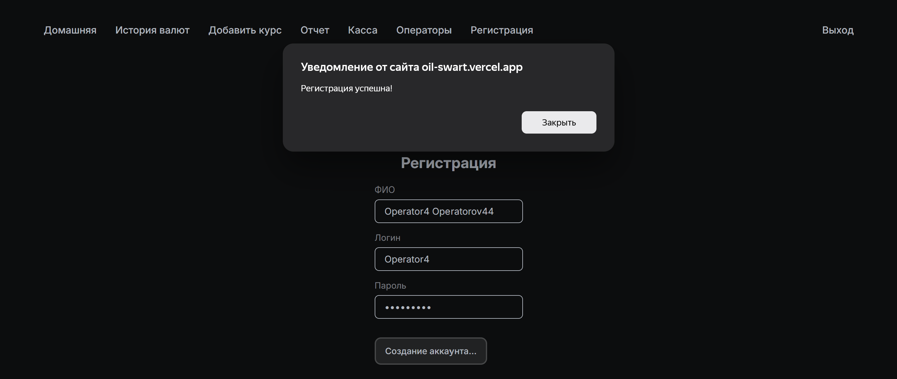
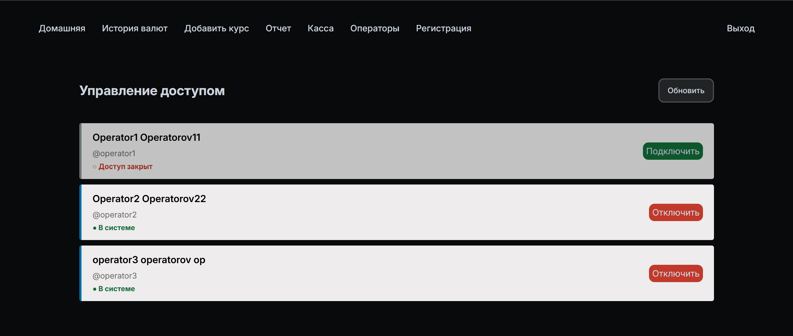
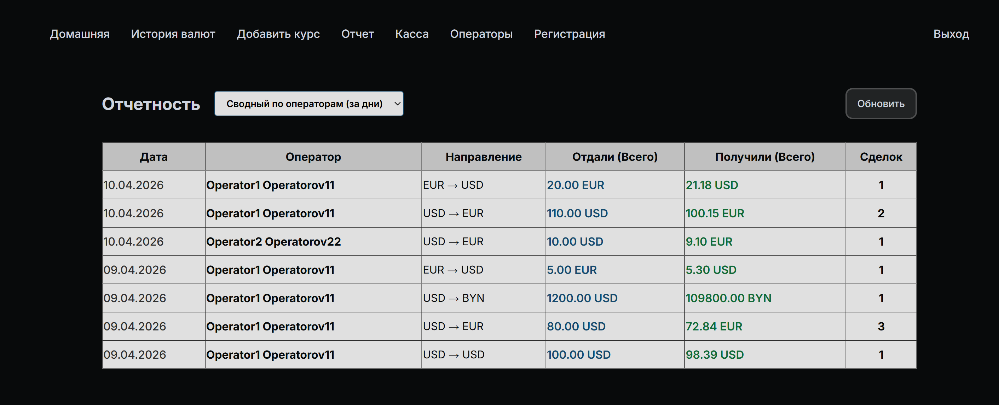
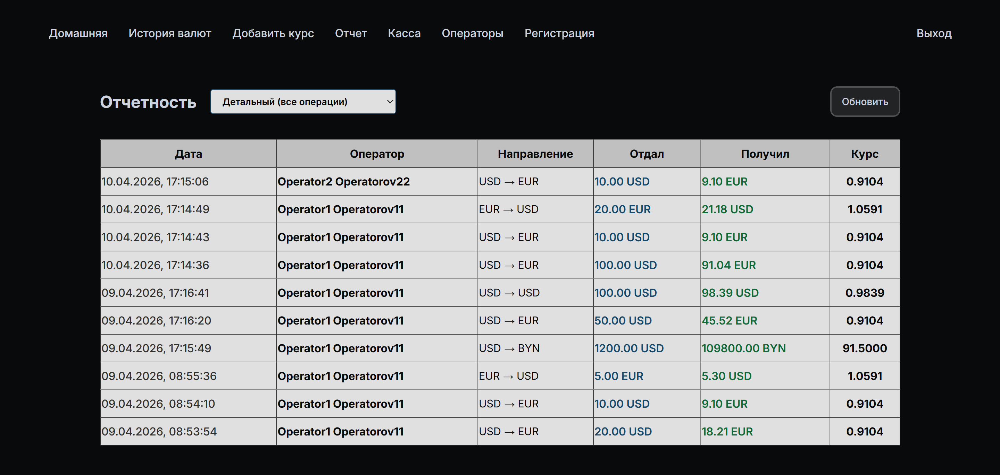
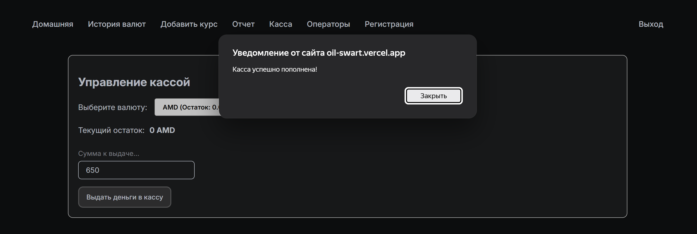
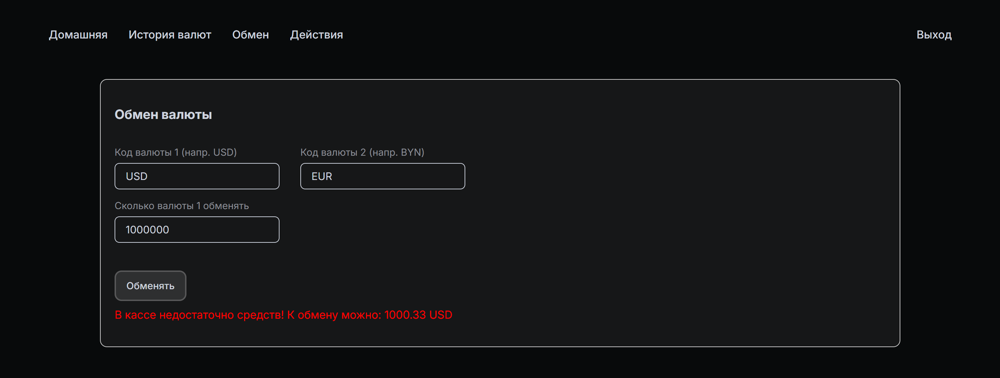
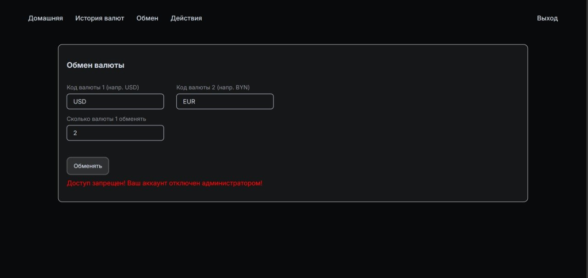
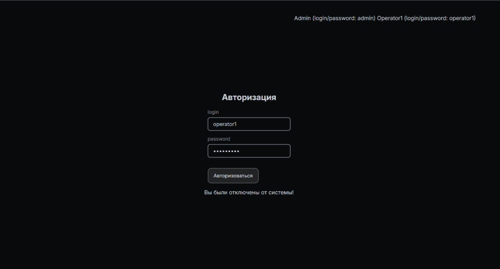
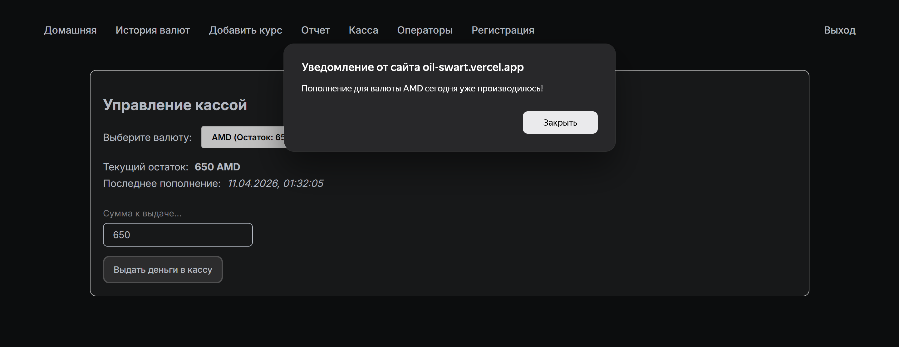
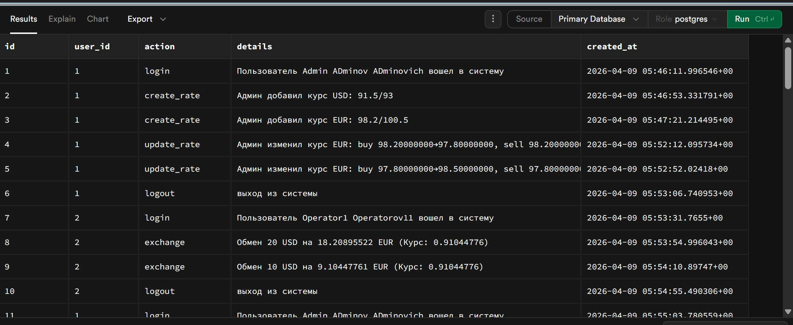

# Обменник (React + Node.js + PostgreSQL)

#### [Открыть в браузере ->](https://oil-swart.vercel.app/) 

```
P.s. Обновления - снизу README

P.p.s Функционал только под требования. Короткие сроки. Упор как на MVP

P.p.p.s К таблице логирования должен быть скрин (рис. 17) - пропустил. Но сама таблица была реализована по SQL запросам.
```


## Краткое руководство по использованию

В системе реализованы две роли:
- администратор
- оператор

### Администратор имеет следующие возможности:
- авторизация (рис. 1);
- просмотр текущих курсов валюты (рис. 2);
- просмотр истории изменения курсов валют (рис. 3);
- добавить новый курс валюты, имеющейся в системе (рис. 4);
- просмотреть отчет об обмене валют (рис. 5).

### Оператор имеет следующие возможности:
- авторизация (рис. 1);
- просмотр текущих курсов валюты (рис. 2);
- произвести обмен валют по текущему курсу (рис. 6);
- просмотреть дейсвтия за текущую сессию - при выходе из аккаунта сессия сбрасывается (рис. 7);

---

#### Рисунок 1 - Авторизация


#### Рисунок 2 - Текущие курсы валют


#### Рисунок 3 - Изменение курсов валют


#### Рисунок 4 - Добавление нового курса валют


#### Рисунок 5 - Отчет об обмене валют


#### Рисунок 6 - Обмен валюты


#### Рисунок 7 - Действия за текущую сессию


---

### Добавлен новый функционал (второе требование)

- регистрация оператора (рис. 8);
- блокировка/разблокировка оператора (рис. 9);
- два новых отчета (по операторам за дни и детальный) (рис. 10 и рис. 11);
- добавлена возможность пополнять банк (деньги) кассы (рис. 12);
- обновлена функция обмена (если в кассе недостаточно средств) (рис. 13);

Обработка исключений (указаны не все что реализованы в системе, ТОЛЬКО ЧАСТЬ!!!):
- оператор отключен от системы. Попытка обменять валюту (рис. 14);
- оператор отключен от системы. Попытка войти в аккаунт (рис. 15);
- попытка пополнить кассу валютой второй раз за день (рис. 16);

Полный список действий по БД в файле sql2.txt

#### Рисунок 8 - Регистрация оператора


#### Рисунок 9 - Блокировка/разблокировка оператора


#### Рисунок 10 - Отчет по операторам за дни


#### Рисунок 11 - Детальный отчет


#### Рисунок 12 - Пополнение кассы


#### Рисунок 13 - Обмен средств (ситуация, когда нету нужных средств в кассе)


#### Рисунок 14 - Оператор отключен от системы. Попытка обменять валюту


#### Рисунок 15 - Оператор отключен от системы. Попытка войти в аккаунт


#### Рисунок 16 - Попытка пополнить кассу валютой второй раз за день


---

#### Рисунок 17 - Таблица логирования


### По вопросам

tg: @Stasi4ekKk  
gmail: stanislav71492584@gmail.com
