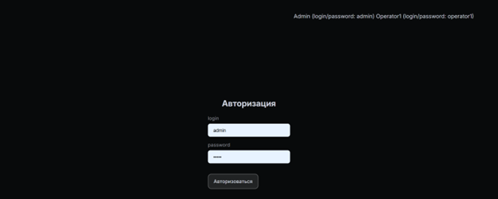
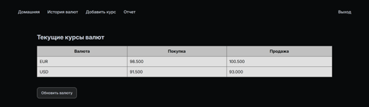
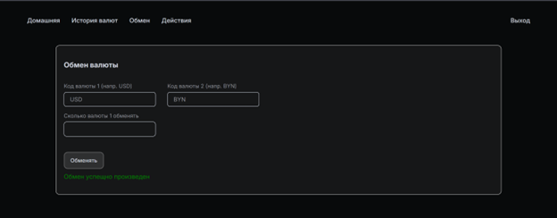
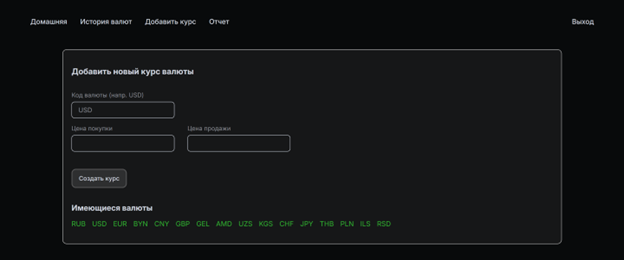
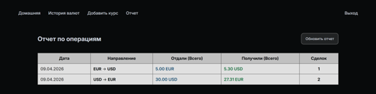
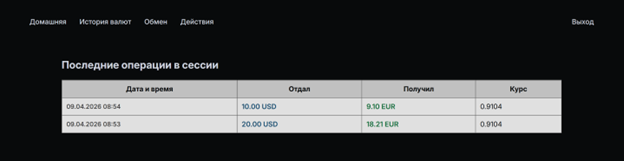

# Обменник (React + Node.js + PostgreSQL)

#### [Открыть в браузере ->](https://oil-swart.vercel.app/) 

## Краткое руководство по использованию

В системе реализованы две роли:
- администратор
- оператор

### Администратор имеет следующие возможности:
- авторизация (рис. 1);
- просмотр текущих курсов валюты (рис. 2);
- просмотр истории изменения курсов валют (рис. 3);
- добавить новый курс валюты, имеющейся в системе (рис. 4);
- просмотреть отчет об обмене валют (рис. 5).

### Оператор имеет следующие возможности:
- авторизация (рис. 1);
- просмотр текущих курсов валюты (рис. 2);
- произвести обмен валют по текущему курсу (рис. 6);
- просмотреть дейсвтия за текущую сессию - при выходе из аккаунта сессия сбрасывается (рис. 7);

---

#### Рисунок 1 - Авторизация

#### Рисунок 2 - Текущие курсы валют

#### Рисунок 3 - Изменение курсов валют

#### Рисунок 4 - Добавление нового курса валют

#### Рисунок 5 - Отчет об обмене валют

#### Рисунок 6 - Обмен валюты

#### Рисунок 7 - Действия за текущую сессию

